# Freshcast

AI-powered sales tracking and demand prediction for small retail businesses. Log daily sales in natural language, get insights and forecasts — without the complexity of traditional POS systems.

**[Live Demo →](https://freshcast-au.vercel.app/)** · **[AWS Demo →](https://freshcast.site/)** · Demo login: `demo@freshcast.app` / `demo1234`

<p align="center">
  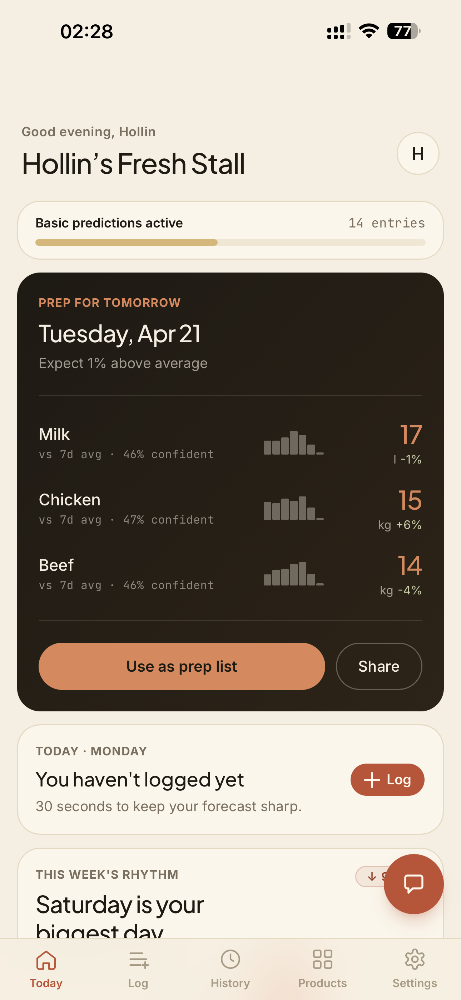
  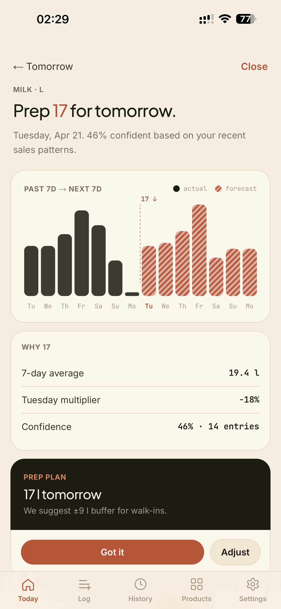
  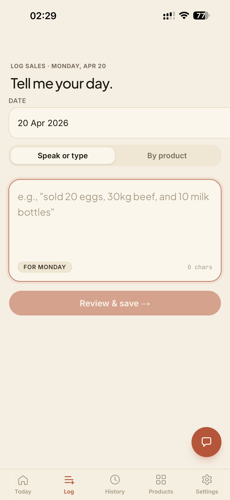
  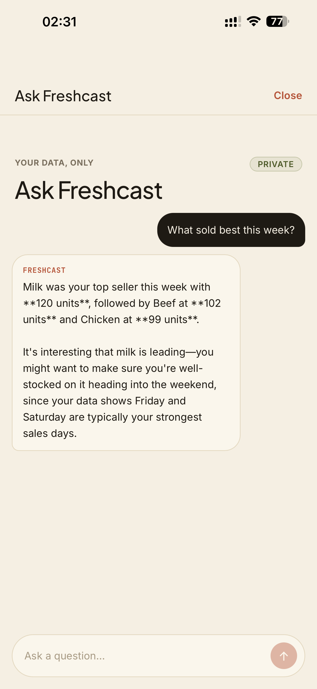
</p>

<details>
<summary>More screenshots</summary>
<p align="center">
  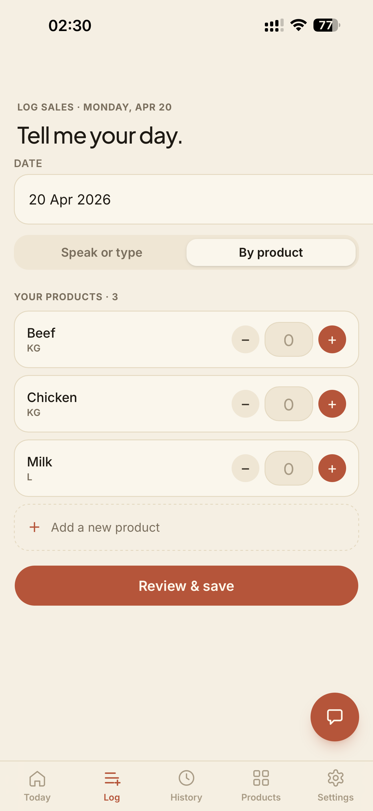
  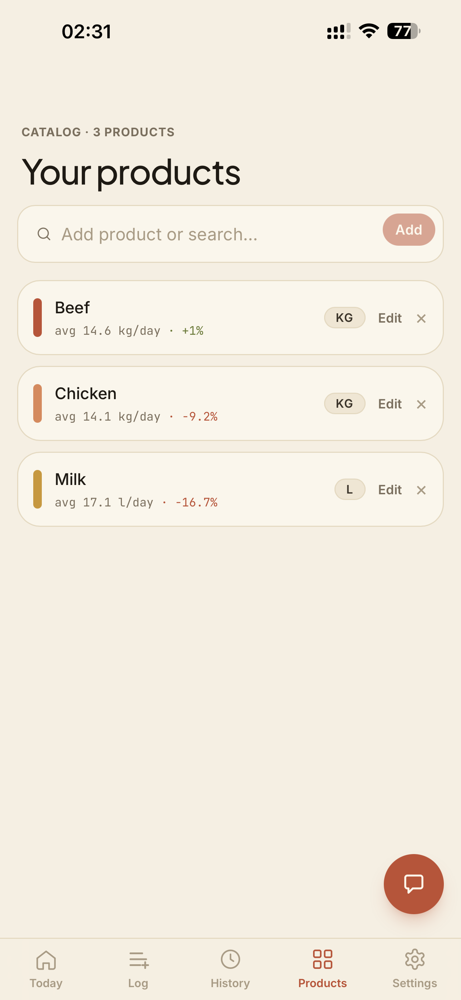
  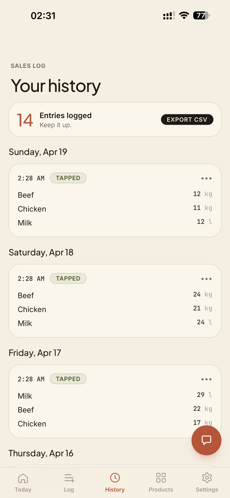
  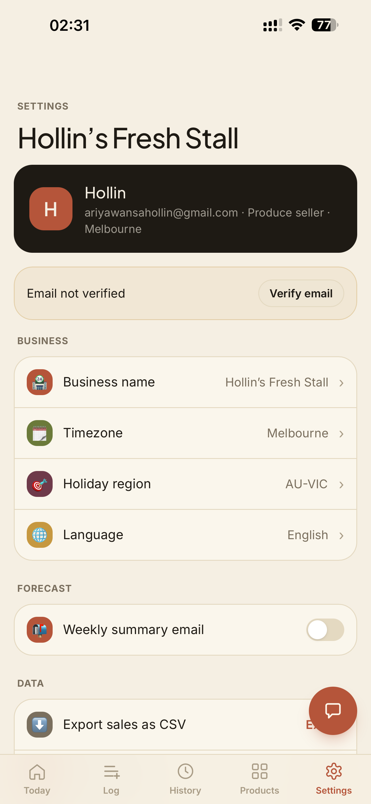
  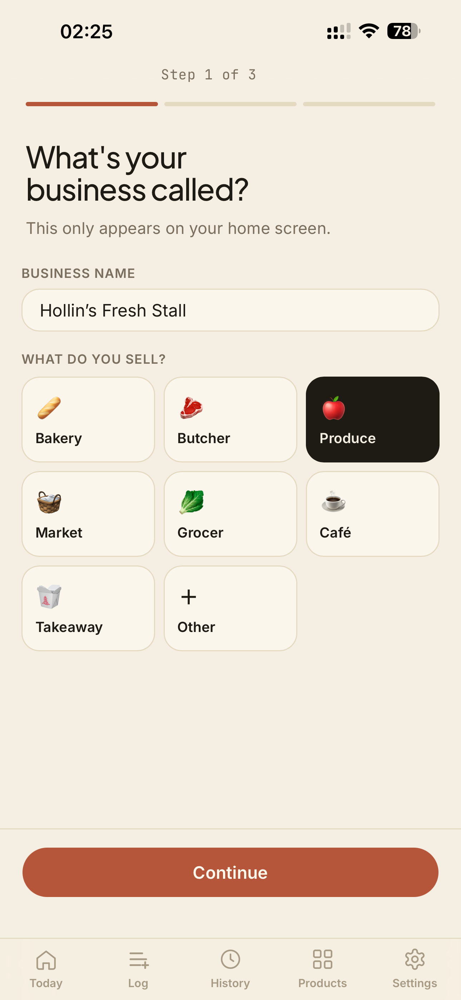
  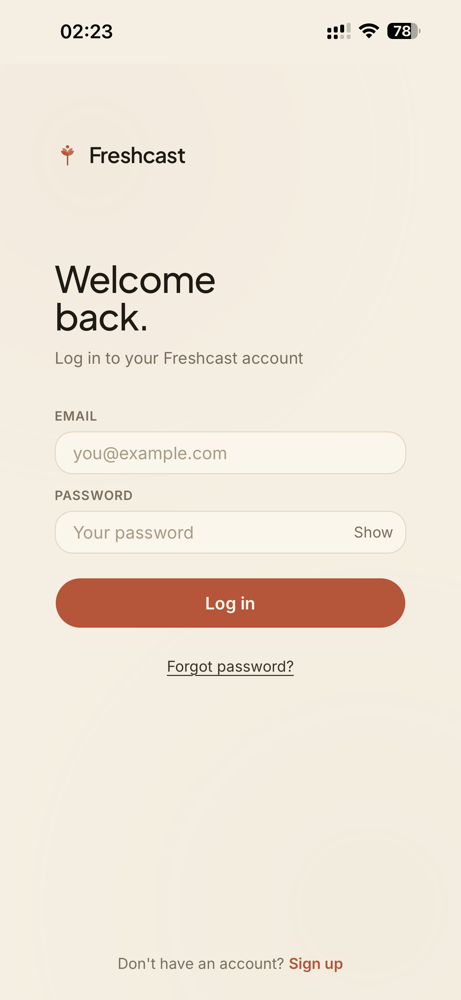
  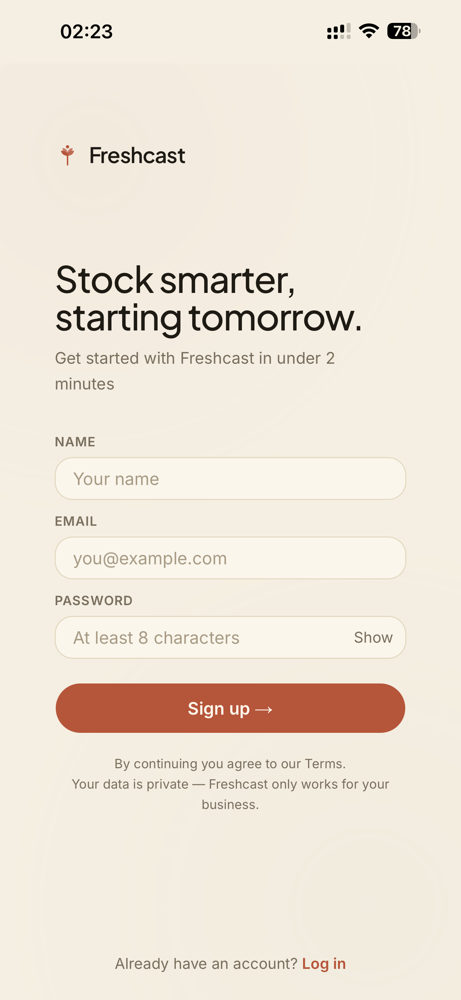
  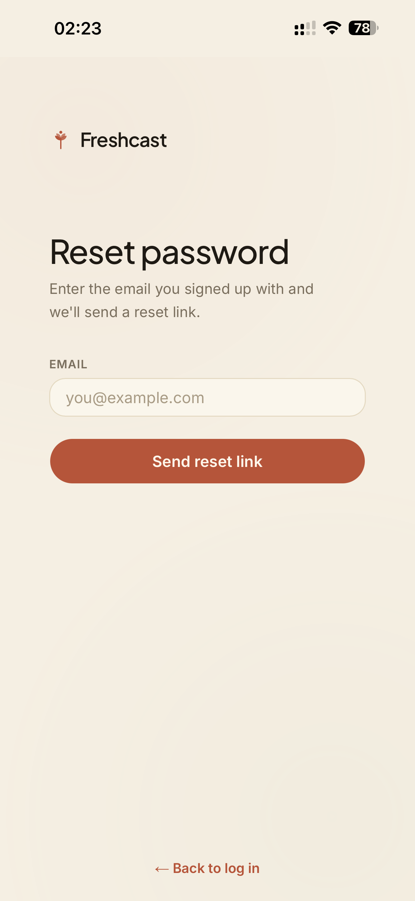
</p>
</details>

---

## What it does

Freshcast helps small business owners (market vendors, butchers, cafés) track what they sell and predict what they'll need tomorrow.

- **Natural language sales input** — type "sold 20 eggs, 30kg beef" and the parser extracts structured data
- **Manual form input** — tap through a product list with quantity fields
- **Demand predictions** — "You may need ~25 eggs tomorrow" based on weekday patterns and recent trends
- **Auto-generated insights** — "Egg sales increased 23% this week", "Friday is your strongest day"
- **Dashboard** — today's summary, weekly trends with bar chart, top products, forecasts

## How it works

### Sales Parser

A rule-based NL parser tokenizes input by commas and "and", extracts quantities and units (kg, g, liters, dozen), and fuzzy-matches product names against the user's catalog using Levenshtein distance, substring matching, and plural normalization. Unmatched items are flagged as new products for the user to confirm.

### Prediction Engine

Uses a weighted blend of two signals:
- **Weekday pattern** (60%) — averages the last 4 occurrences of the same weekday
- **Recent trend** (40%) — averages the last 7 days

Confidence scoring adjusts based on data volume and variance. Predictions start after 5 days of data.

### Insight Generator

LLM-powered insight generation (Claude Haiku) with template-based fallback. Produces headline + description pairs for the dashboard. Computes per-product trends, week-over-week comparisons, top product concentration, and weekday patterns. Generated on-demand when the dashboard detects stale data (>24 hours), cached in the database to avoid redundant LLM calls.

## Tech Stack

| Layer | Technology |
|-------|-----------|
| Framework | Next.js 16 (App Router, Turbopack) |
| Language | TypeScript (strict mode) |
| UI | Tailwind CSS v4, shadcn/ui, Fraunces + Inter + JetBrains Mono |
| State | React Query (TanStack Query) |
| Forms | react-hook-form + Zod v4 |
| Auth | Auth.js v5 (Credentials provider, JWT) |
| Database | PostgreSQL (Neon serverless) |
| ORM | Prisma v7 (ESM, PrismaPg adapter) |
| AI | Claude Haiku (Anthropic) — NL parsing, insights, chat |
| Email | Amazon SES (primary), Resend (fallback) |
| Scheduling | Amazon EventBridge (AWS), Vercel Cron (fallback) |
| Monitoring | Sentry error tracking |
| i18n | next-intl (externalized strings) |
| Testing | Vitest (52 unit tests), GitHub Actions CI |
| Deployment | Vercel (primary), AWS Amplify (AWS integrations) |

## Architecture

```
Client (Browser)
  └── Next.js App Router (RSC + Client Components)
        ├── API Routes (REST)
        │     ├── Auth (signup, login, password reset)
        │     ├── Business & Products (CRUD)
        │     ├── Sales (parse, create, list, delete)
        │     ├── Dashboard (aggregated single-call)
        │     ├── Chat (AI-powered Q&A)
        │     └── Health & Admin
        ├── Services
        │     ├── Sales Parser (LLM + rule-based fallback)
        │     ├── Product Matcher (fuzzy matching)
        │     ├── Analytics (trends, comparisons)
        │     ├── Prediction Engine (moving averages + holidays)
        │     ├── Insight Generator (LLM + template fallback)
        │     └── Weekly Email (summary + forecast)
        ├── AWS Services
        │     ├── SES (email delivery)
        │     └── EventBridge (scheduled jobs)
        └── Prisma ORM → PostgreSQL (Neon)
```

Key architectural decisions are documented in [ADRs](docs/adr/README.md).

## Project Documentation

This project was built with a spec-driven development approach:

- **[Product Requirements Document](docs/PRD.md)** — features, user stories, success metrics
- **[Architecture Decision Records](docs/adr/README.md)** — 16 ADRs covering auth strategy, NL parsing, editorial rebrand, data isolation, and more
- **[Technical Design Document](docs/TDD.md)** — system architecture, data model, full API contracts, service algorithms
- **[Implementation Plan](docs/IMPLEMENTATION_PLAN.md)** — 28+ phases with tasks, acceptance criteria, and completion tracking
- **[Improvement Backlog](docs/BACKLOG.md)** — prioritized list of future enhancements and AWS integrations

## Getting Started

### Prerequisites

- Node.js 20+
- PostgreSQL database (or [Neon](https://neon.tech) free tier)

### Setup

```bash
git clone https://github.com/Hollin-A/freshcast.git
cd freshcast
npm install
```

Create a `.env` file:

```env
DATABASE_URL=postgresql://...
AUTH_SECRET=your-secret-here
AUTH_URL=http://localhost:3000
```

Set up the database:

```bash
npx prisma db push
npx prisma generate
```

Optionally seed with demo data:

```bash
npx tsx prisma/seed.ts
```

Run the dev server:

```bash
npm run dev
```

Open [http://localhost:3000](http://localhost:3000).

## Testing

Run the test suite:

```bash
npm test
```

Tests cover core business logic: sales parser, product matcher, prediction engine, unit normalizer, date utilities, holiday multipliers, and rate limiter. All tests are pure unit tests with no database or network calls.

CI runs automatically on every push and PR via GitHub Actions — linting, type checking, and tests.

## What I Built vs What I Deferred

### Implemented (MVP + Post-MVP)

- Email/password auth with password reset and email verification
- Show/hide password toggle on all auth forms
- 3-step onboarding with timezone auto-detection and emoji business type tiles
- Dual-mode sales input (LLM parser with rule-based fallback + manual form)
- Business-type-aware placeholder text in NL input
- Unit normalization (50+ variations mapped to consistent values)
- Ambiguous quantity detection ("few eggs" → clarification prompt)
- Fuzzy product matching with inline product creation
- Editable product names in confirmation screen with client-side re-matching
- Multiple entries per day with original NL text saved
- Date picker for logging past dates
- Dashboard with forecast hero (sparklines, trends, prep list), week rhythm chart, top products, insights
- Forecast detail drill-in with 14-day chart (past + forecast) and prediction breakdown
- Holiday-aware predictions (AU-VIC public holidays with multipliers)
- Multi-tier prediction progress bar (auto-hides at 30+ entries)
- Prediction engine with confidence scoring and breakdown factors
- LLM-powered insight generation (headline + description) with template fallback
- AI chat interface (floating bubble) — ask business questions, get data-driven answers
- Per-product analytics on products page (daily average, week-over-week trend)
- Weekly summary email (opt-in, EventBridge scheduled)
- Email delivery via Amazon SES (primary) with Resend fallback
- Sentry error monitoring
- Health endpoint (`/api/health`)
- Input sanitization (XSS protection on text fields)
- Versioned LLM prompts (`src/prompts/`)
- Atomic database operations (transactions)
- Product ownership verification (business isolation)
- Timezone-aware date handling throughout
- Structured logging, error boundaries, loading skeletons, splash screen
- i18n architecture (externalized strings, next-intl)
- Demo data loading for new users
- Demo account protection (undeletable, password unchangeable)
- PWA support (installable, offline fallback)
- Rate limiting on auth, chat, and parse endpoints
- CSV export of sales history
- Account and data deletion
- Settings page with email verification, holiday region, weekly email toggle
- 52 unit tests (Vitest) with GitHub Actions CI
- Docker support (multi-stage Dockerfile)
- Dual deployment: Vercel + AWS Amplify
- Warm editorial color theme (cream, terracotta, olive), mobile-first responsive design

### Deferred (Post-MVP)

- Magic link (passwordless) authentication
- Voice input, receipt/photo parsing (OCR via Textract planned)
- ML-based advanced forecasting, seasonal patterns
- Native mobile apps (iOS/Android)
- Multi-user per business with role-based access
- POS integrations, supplier management
- Streaming chat responses
- Push notifications (morning prep reminders)

## License

MIT
