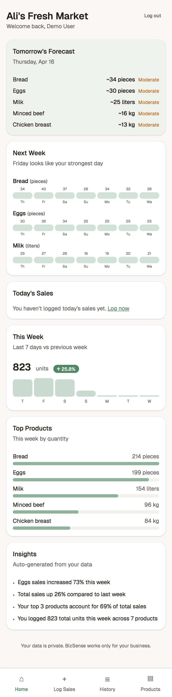
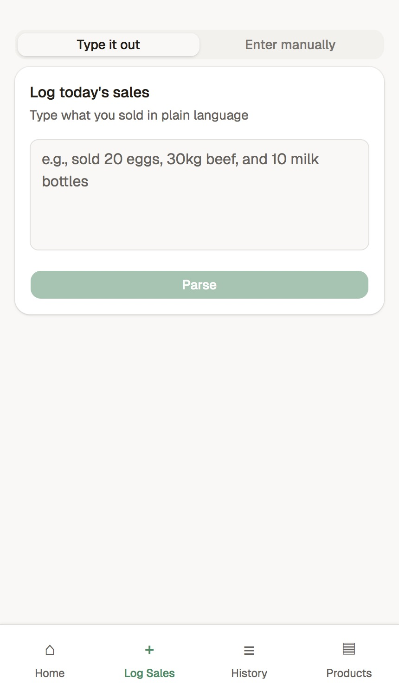
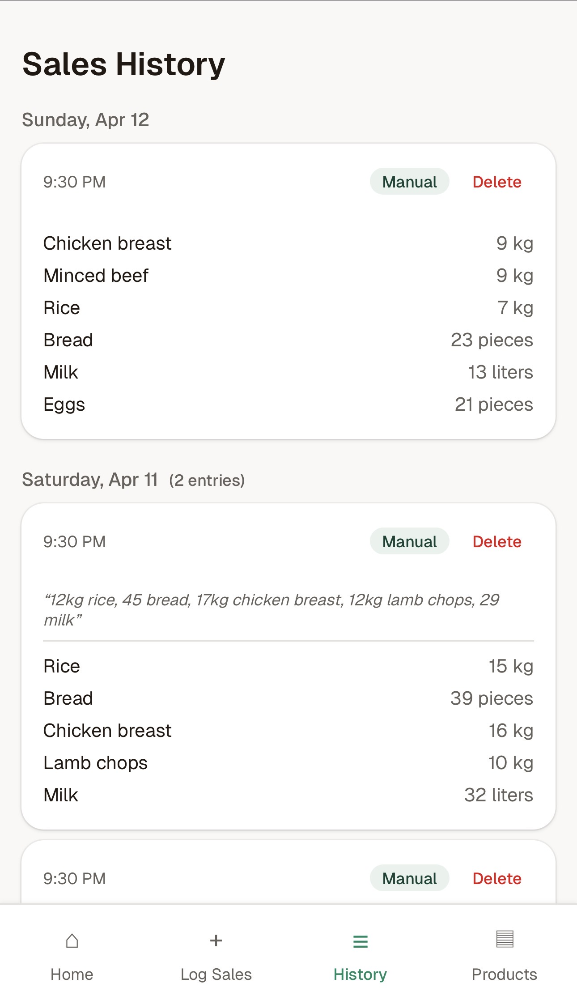
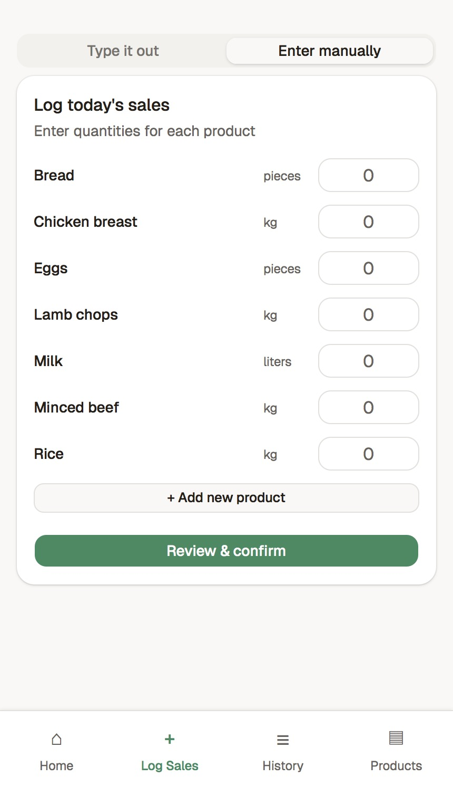
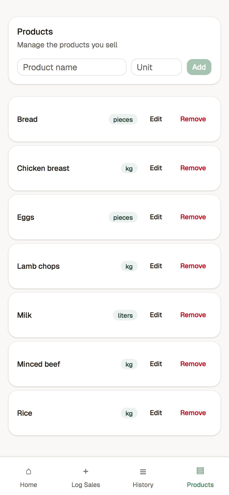
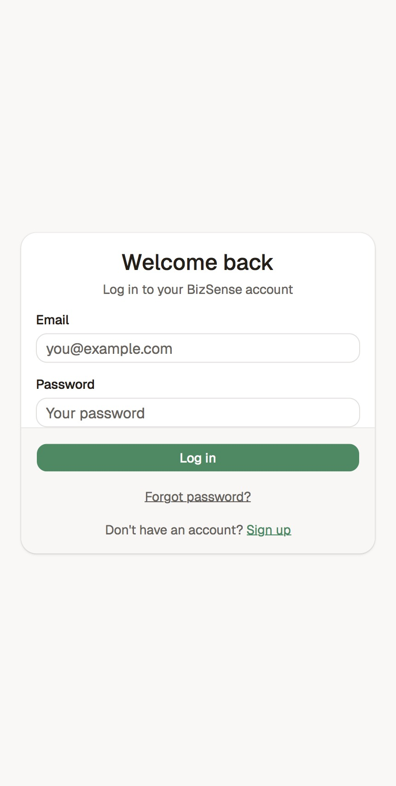
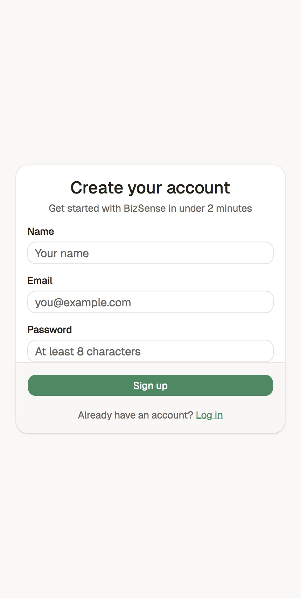
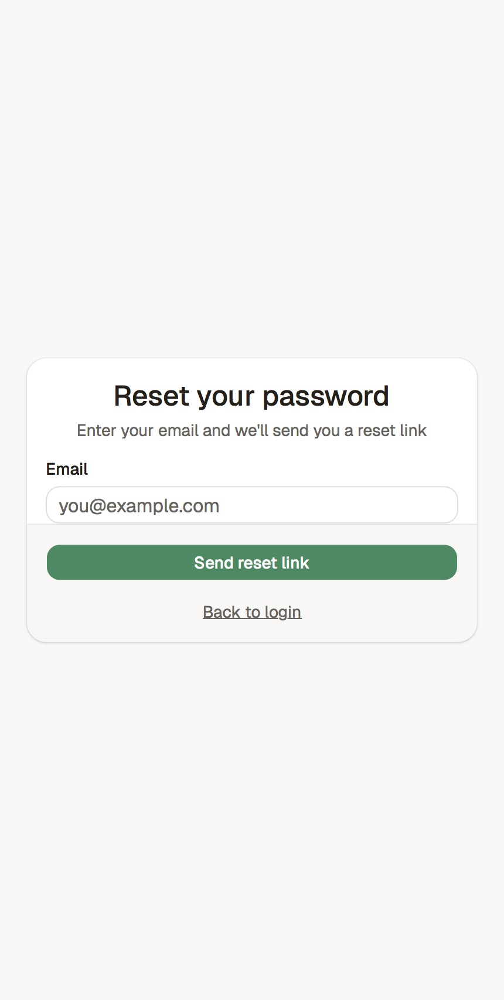

# BizSense

AI-powered sales tracking and demand prediction for small retail businesses. Log daily sales in natural language, get insights and forecasts — without the complexity of traditional POS systems.

**[Live Demo →](https://bizsense-au.vercel.app/)** · Demo login: `demo@bizsense.app` / `demo1234`

<p align="center">
  
  
  
</p>

<details>
<summary>More screenshots</summary>
<p align="center">
  
  
  
  
  
</p>
</details>

---

## What it does

BizSense helps small business owners (market vendors, butchers, cafés) track what they sell and predict what they'll need tomorrow.

- **Natural language sales input** — type "sold 20 eggs, 30kg beef" and the parser extracts structured data
- **Manual form input** — tap through a product list with quantity fields
- **Demand predictions** — "You may need ~25 eggs tomorrow" based on weekday patterns and recent trends
- **Auto-generated insights** — "Egg sales increased 23% this week", "Friday is your strongest day"
- **Dashboard** — today's summary, weekly trends with bar chart, top products, forecasts

## How it works

### Sales Parser

A rule-based NL parser tokenizes input by commas and "and", extracts quantities and units (kg, g, liters, dozen), and fuzzy-matches product names against the user's catalog using Levenshtein distance, substring matching, and plural normalization. Unmatched items are flagged as new products for the user to confirm.

### Prediction Engine

Uses a weighted blend of two signals:
- **Weekday pattern** (60%) — averages the last 4 occurrences of the same weekday
- **Recent trend** (40%) — averages the last 7 days

Confidence scoring adjusts based on data volume and variance. Predictions start after 5 days of data.

### Insight Generator

Template-based NL generation that computes per-product trends, week-over-week comparisons, top product concentration, and weekday patterns. Generated on-demand when the dashboard detects stale data (>24 hours).

## Tech Stack

| Layer | Technology |
|-------|-----------|
| Framework | Next.js 16 (App Router, Turbopack) |
| Language | TypeScript (strict mode) |
| UI | Tailwind CSS v4, shadcn/ui, Geist font |
| State | React Query (TanStack Query) |
| Forms | react-hook-form + Zod v4 |
| Auth | Auth.js v5 (Credentials provider, JWT) |
| Database | PostgreSQL (Neon serverless) |
| ORM | Prisma v7 (ESM, PrismaPg adapter) |
| i18n | next-intl (externalized strings) |
| Deployment | Vercel |

## Architecture

```
Client (Browser)
  └── Next.js App Router (RSC + Client Components)
        ├── API Routes (REST)
        │     ├── Auth (signup, login, password reset)
        │     ├── Business & Products (CRUD)
        │     ├── Sales (parse, create, list, delete)
        │     └── Dashboard (aggregated single-call)
        ├── Services
        │     ├── Sales Parser (rule-based NL)
        │     ├── Product Matcher (fuzzy matching)
        │     ├── Analytics (trends, comparisons)
        │     ├── Prediction Engine (moving averages)
        │     └── Insight Generator (template-based)
        └── Prisma ORM → PostgreSQL (Neon)
```

Key architectural decisions are documented in [ADRs](docs/adr/README.md).

## Project Documentation

This project was built with a spec-driven development approach:

- **[Product Requirements Document](docs/PRD.md)** — features, user stories, success metrics
- **[Architecture Decision Records](docs/adr/README.md)** — 10 ADRs covering auth strategy, NL parsing approach, batch vs real-time, data isolation, and more
- **[Technical Design Document](docs/TDD.md)** — system architecture, data model, full API contracts, service algorithms
- **[Implementation Plan](docs/IMPLEMENTATION_PLAN.md)** — 10 phases with tasks, acceptance criteria, and completion tracking

## Getting Started

### Prerequisites

- Node.js 20+
- PostgreSQL database (or [Neon](https://neon.tech) free tier)

### Setup

```bash
git clone https://github.com/Hollin-A/bizsense.git
cd bizsense
npm install
```

Create a `.env` file:

```env
DATABASE_URL="postgresql://..."
AUTH_SECRET="your-secret-here"  # generate with: openssl rand -base64 32
AUTH_URL="http://localhost:3000"
```

Set up the database:

```bash
npx prisma db push
npx prisma generate
```

Optionally seed with demo data:

```bash
npx tsx prisma/seed.ts
```

Run the dev server:

```bash
npm run dev
```

Open [http://localhost:3000](http://localhost:3000).

## What I Built vs What I Deferred

### Implemented (MVP + Post-MVP)

- Email/password auth with password reset and email verification (Resend)
- Show/hide password toggle on all auth forms
- 2-step onboarding with timezone auto-detection
- Dual-mode sales input (LLM parser with rule-based fallback + manual form)
- Unit normalization (50+ variations mapped to consistent values)
- Ambiguous quantity detection ("few eggs" → clarification prompt)
- Fuzzy product matching with inline product creation
- Multiple entries per day with original NL text saved
- Date picker for logging past dates
- Dashboard with 8 card types (prediction progress, forecast with holiday indicator, spike alert, today, week trend, top products, weekly forecast, insights)
- Holiday-aware predictions (AU-VIC public holidays with multipliers)
- Multi-tier prediction progress bar (0–4 / 5–14 / 15–29 / 30+)
- Prediction engine with confidence scoring
- LLM-powered insight generation (Claude Haiku) with template fallback
- AI chat interface — ask business questions, get data-driven answers
- Atomic database operations (transactions)
- Product ownership verification (business isolation)
- Timezone-aware date handling throughout
- Structured logging, error boundaries, loading skeletons, splash screen
- i18n architecture (externalized strings, next-intl)
- Demo data loading for new users
- PWA support (installable, offline fallback)
- Email delivery via Resend (password reset + verification)
- Rate limiting on auth endpoints
- CSV export of sales history
- Account and data deletion
- Settings page with email verification status
- Unit override per sale entry in manual mode
- Warm teal color theme, mobile-first responsive design

### Deferred (Post-MVP)

- Magic link (passwordless) authentication
- Voice input, receipt/photo parsing
- ML-based advanced forecasting, seasonal patterns
- Native mobile apps (iOS/Android)
- Multi-user per business with role-based access
- Weekly summary email notifications
- POS integrations, supplier management
- Streaming chat responses

## License

MIT
