# Freshcast

AI-powered sales tracking and demand prediction for small retail businesses. Log daily sales in natural language, get insights and forecasts — without the complexity of traditional POS systems.

**[Live Demo →](https://freshcast.site/)** · Demo login: `demo@freshcast.site` / `demo1234`

<p align="center">
  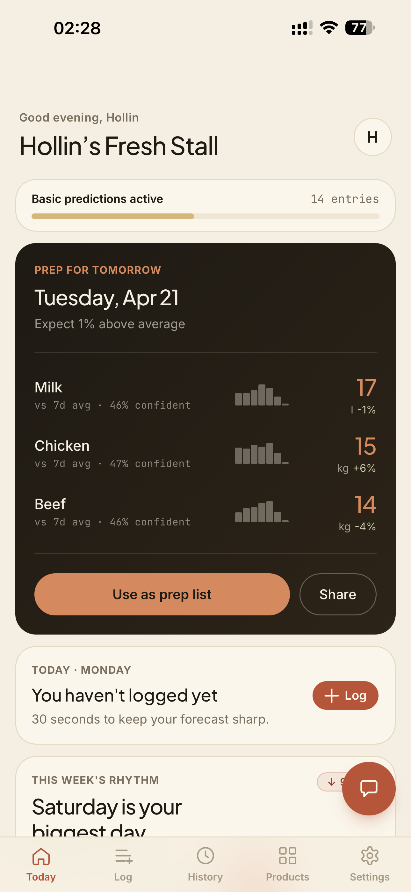
  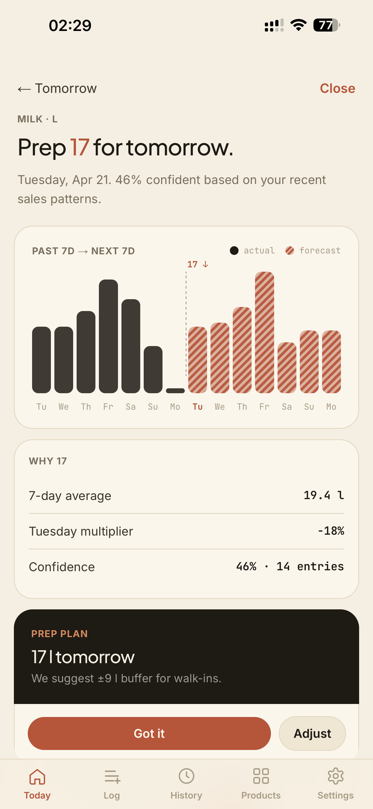
  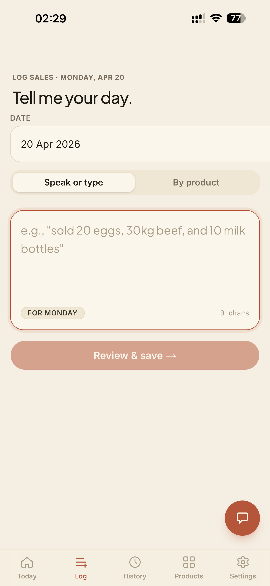
  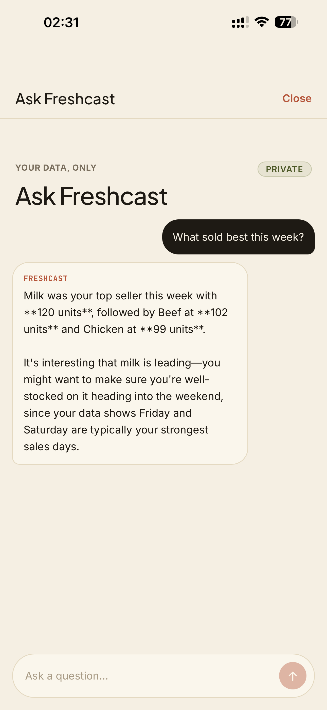
</p>

<details>
<summary>More screenshots</summary>
<p align="center">
  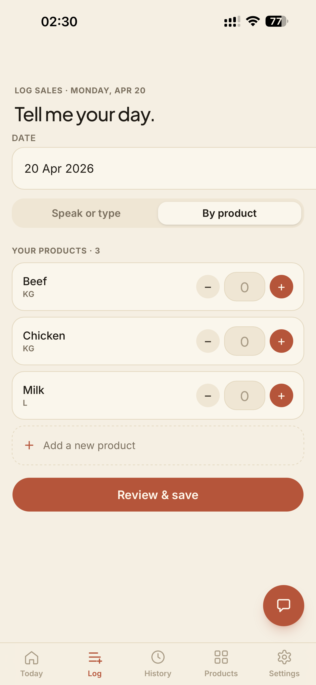
  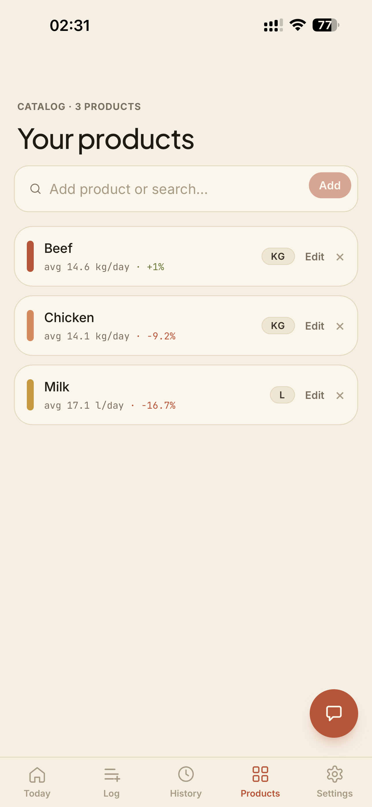
  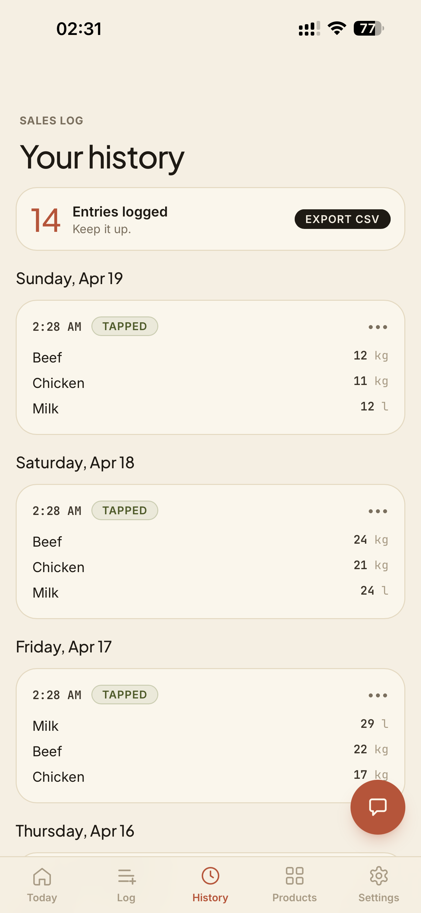
  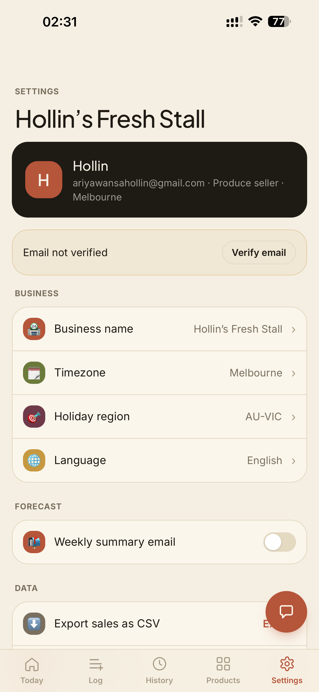
  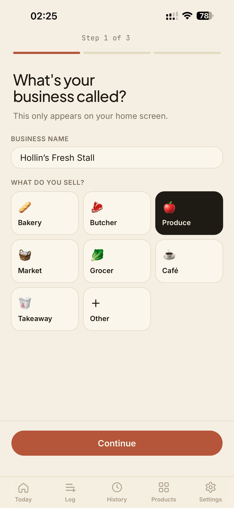
  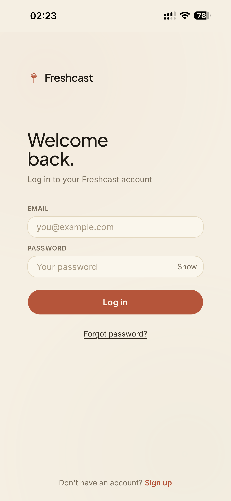
  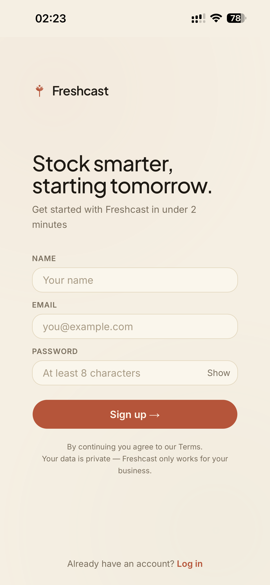
  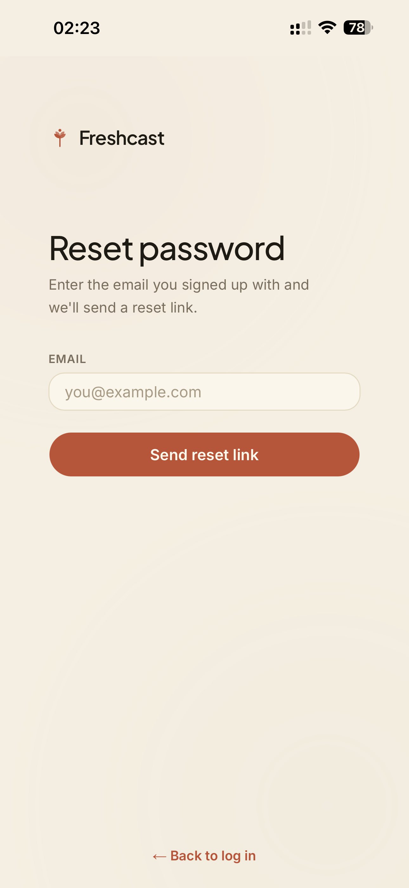
</p>
</details>

---

## What it does

Freshcast helps small business owners (market vendors, butchers, cafés) track what they sell and predict what they'll need tomorrow.

- **Natural language sales input** — type "sold 20 eggs, 30kg beef" and the parser extracts structured data
- **Manual form input** — tap through a product list with quantity fields
- **Receipt photo upload** — snap a supplier or POS receipt; AWS Textract `AnalyzeExpense` extracts structured line items, the LLM maps them to your products, and you confirm before saving. *Currently switched off by default (`RECEIPT_UPLOAD_ENABLED`); see [ADR-019](docs/adr/019-receipt-ocr-hardening.md).*
- **Demand predictions** — "You may need ~25 eggs tomorrow" based on weekday patterns and recent trends, with holiday-aware adjustments
- **Auto-generated insights** — "Egg sales increased 23% this week", "Friday is your strongest day"
- **AI chat** — ask questions about your own data ("what sold best this week?")
- **Weekly summary email** — opt-in digest with last week's totals and the week-ahead forecast. *Paused: being rebuilt on a scheduled job queue ([#42](https://github.com/Hollin-A/freshcast/issues/42)).*
- **Dashboard** — today's summary, weekly trends with bar chart, top products, forecasts, demand spike alerts

## How it works

- **Sales parsing** is LLM-primary with a rule-based fallback. Typed input goes to Claude Haiku (raw text + the user's product catalogue) to extract structured `{product, quantity, unit}` items; if the LLM is unavailable, a rule-based parser tokenizes and fuzzy-matches against the catalogue. Receipts take a separate path — AWS Textract `AnalyzeExpense` returns structured line items that an LLM maps to known products (per [ADR-019](docs/adr/019-receipt-ocr-hardening.md)). Everything flows through the same unit normalizer and confirmation screen before saving.
- **Demand prediction** blends a weekday pattern with a recent-trend signal, applies holiday-aware adjustments, and scores confidence by data volume and variance. Predictions begin after 5 days of data.
- **Insights** are LLM-generated (Claude Haiku) with a template fallback, computed on-demand when dashboard data is stale and cached to avoid redundant LLM calls.

Full algorithms, weights, and service contracts are documented in [Architecture](docs/ARCHITECTURE.md).

## Tech Stack

| Layer | Technology |
|-------|-----------|
| Framework | Next.js 16 (App Router, Turbopack) |
| Language | TypeScript (strict mode) |
| UI | Tailwind CSS v4, shadcn/ui, Fraunces + Inter + JetBrains Mono |
| State | React Query (TanStack Query) |
| Forms | react-hook-form + Zod v4 (schemas shared via `@freshcast/shared`) |
| Auth | Auth.js v5 (Credentials provider, JWT) |
| Database | PostgreSQL (Neon serverless) |
| ORM | Prisma v7 (ESM, PrismaPg adapter) in `@freshcast/db` |
| AI | Claude Haiku (Anthropic) — NL parsing, insights, chat, receipt mapping |
| Email | Amazon SES (primary), Resend (fallback) |
| Scheduling | Paused; to be rebuilt on EventBridge Scheduler + SQS ([#42](https://github.com/Hollin-A/freshcast/issues/42)) |
| OCR | Amazon Textract `AnalyzeExpense` (receipts) |
| Storage | Amazon S3 (receipt images, presigned uploads) |
| Secrets | AWS Secrets Manager (vendor API keys, hybrid env→SM resolver) |
| Monitoring | Structured JSON logs with request IDs (CloudWatch); Sentry (initialization fix pending, [#68](https://github.com/Hollin-A/freshcast/issues/68)) |
| i18n | next-intl (externalized strings) |
| Testing | Vitest (92 unit tests), GitHub Actions CI (lint, type check, test, build) |
| Deployment | AWS Amplify |
| Monorepo | pnpm workspaces + Turborepo |

## Architecture

```
Client (Browser, PWA) — forms validate with @freshcast/shared
  └── apps/web — Next.js App Router (RSC + Client Components) on AWS Amplify
        ├── proxy.ts (session check, request IDs)
        ├── API Routes (REST, { data } / { error } envelope)
        │     ├── Auth (signup, login, password reset, email verification)
        │     ├── Business & Products (CRUD)
        │     ├── Sales (parse, create, list, edit, delete, export CSV)
        │     ├── Receipts (presigned upload, OCR + parse; off by default)
        │     ├── Dashboard (aggregated single-call)
        │     ├── Predictions & Insights (cached + on-demand)
        │     ├── Chat (AI-powered Q&A)
        │     ├── Weekly summary email (paused, #42)
        │     └── Health & Demo
        ├── Services
        │     ├── Sales Parser (LLM + rule-based fallback)
        │     ├── Receipt Parser (LLM + structured rule-based, opt-in fallback)
        │     ├── Product Matcher (fuzzy matching)
        │     ├── Analytics (trends, comparisons)
        │     ├── Prediction Engine (moving averages + weekday + holidays)
        │     ├── Insight Generator (LLM + template fallback)
        │     ├── Chat Context Builder (business data → Claude prompt)
        │     └── Weekly Email (summary + forecast; scheduling paused)
        ├── AWS Services
        │     ├── SES (auth emails)
        │     ├── S3 + Textract `AnalyzeExpense` (receipts)
        │     └── Secrets Manager (Anthropic, Resend, cron secret)
        ├── @freshcast/shared — Zod schemas, API envelope types, shared constants
        └── @freshcast/db — Prisma client factory → PostgreSQL (Neon)
```

### Repository layout

```
apps/web          Next.js app: pages, API routes, services (@freshcast/web)
packages/db       Prisma schema, migrations, seed and client factory (@freshcast/db)
packages/shared   Zod request schemas, API envelope types, constants (@freshcast/shared)
docs/             Architecture, API reference, ADRs
```

The repo is a pnpm workspace built with Turborepo. Build, deployment and preview-branch practice are described in [Architecture → Build and Deployment](docs/ARCHITECTURE.md#12-build-and-deployment); day-to-day commands are in the [Contributing Guide](CONTRIBUTING.md#repository-layout).

Key architectural decisions are documented in [ADRs](docs/adr/README.md).

## Project Documentation

- **[Architecture](docs/ARCHITECTURE.md)** — system architecture, data model, service algorithms, security, and operations
- **[API Reference](docs/API.md)** — request/response shapes, error codes, and data models for every endpoint
- **[Architecture Decision Records](docs/adr/README.md)** — 20 ADRs covering auth strategy, NL parsing, editorial rebrand, data isolation, env loading on Amplify, secrets management, receipt OCR hardening, the planned NestJS backend migration, and more
- **[Changelog](CHANGELOG.md)** — shipped changes by release
- **[Contributing Guide](CONTRIBUTING.md)** — branch strategy, PR checklist, and doc-sync rules

### Documentation ownership

To avoid duplication and stale docs, each topic has a single home:

- Architecture, runtime details, and the data model live in `docs/ARCHITECTURE.md`
- Endpoint contracts live in `docs/API.md`
- Architectural decisions live in `docs/adr/`
- Release deltas live in `CHANGELOG.md`

## Getting Started

### Prerequisites

- Node.js 22.22+ or 24.15+ (24 recommended)
- pnpm, via Corepack: run `corepack enable` once and the version pinned in `package.json` is used automatically
- PostgreSQL database (or [Neon](https://neon.tech) free tier)

### Setup

```bash
git clone https://github.com/Hollin-A/freshcast.git
cd freshcast
pnpm install
```

Create `apps/web/.env` (the web app reads its env file from its own folder):

```env
# Required
DATABASE_URL=postgresql://...
AUTH_SECRET=your-secret-here
AUTH_URL=http://localhost:3000

# Recommended for full local-dev experience (LLM + receipt OCR + email)
ANTHROPIC_API_KEY=sk-ant-...           # NL parser, receipt mapping, insights, chat
APP_AWS_REGION=ap-southeast-2
APP_AWS_ACCESS_KEY_ID=...
APP_AWS_SECRET_ACCESS_KEY=...
S3_RECEIPTS_BUCKET=your-receipts-bucket
SES_FROM_EMAIL=verified@example.com    # if exercising email flows locally
RESEND_API_KEY=re_...                  # optional fallback for email
```

Notes:
- Some platforms reserve the `AWS_*` prefix. Freshcast prefers `APP_AWS_*` and also supports `AWS_*` as a fallback.
- LLM features degrade gracefully without `ANTHROPIC_API_KEY` (NL parser falls back to rule-based; insights fall back to templates; chat is disabled). Receipt OCR returns 503 in this case — see [ADR-019](docs/adr/019-receipt-ocr-hardening.md).
- In production, vendor API keys and the cron secret are sourced from AWS Secrets Manager via a hybrid env→SM resolver — see [ADR-018](docs/adr/018-secrets-manager.md). Local dev continues to use plain env vars.

Prisma lives in the `@freshcast/db` package (`packages/db`). Its commands read `DATABASE_URL` from `packages/db/.env`, so create that file with the same `DATABASE_URL` line:

```env
DATABASE_URL=postgresql://...
```

Set up the database by applying the migrations in `packages/db/prisma/migrations`:

```bash
pnpm --filter @freshcast/db migrate:deploy
```

Optionally seed with demo data:

```bash
pnpm --filter @freshcast/db seed
```

Run the dev server:

```bash
pnpm dev
```

Open [http://localhost:3000](http://localhost:3000).

## Testing

Run the test suite:

```bash
pnpm test
```

Tests cover core business logic (sales parsers, product matcher, prediction engine, unit normalizer, date utilities, holiday multipliers, Textract `AnalyzeExpense` mapping, rule-based receipt parser) and platform code (rate limiter, API client, request logging and IDs, logger, receipt cost controls). All tests are pure unit tests with no database or network calls.

CI runs on every pull request and push to `main` via GitHub Actions: lint, type check, tests and a production build. Merging to `main` requires a passing CI check.

## Current Scope

Freshcast is production-ready for single-business usage with:

- Sales logging (natural language + manual)
- Forecasting, insights, and AI chat grounded in business data
- Privacy and safety controls (business isolation, rate limits, account safeguards)
- Operational foundations (structured logging, health checks, CI-gated deploys, testing)

The backend is moving to a dedicated NestJS API ([ADR-020](docs/adr/020-dedicated-nestjs-backend.md)). Planned work is tracked in [GitHub Issues](https://github.com/Hollin-A/freshcast/issues) and on the [project board](https://github.com/users/Hollin-A/projects/1).

## License

MIT
